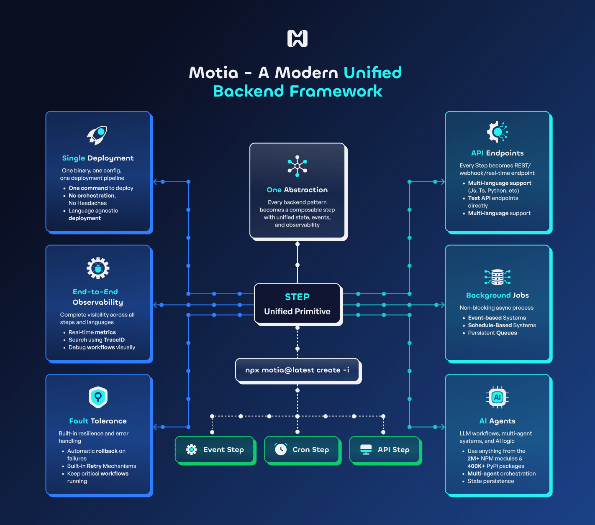
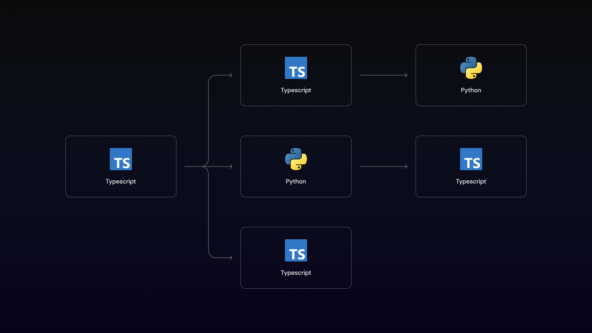
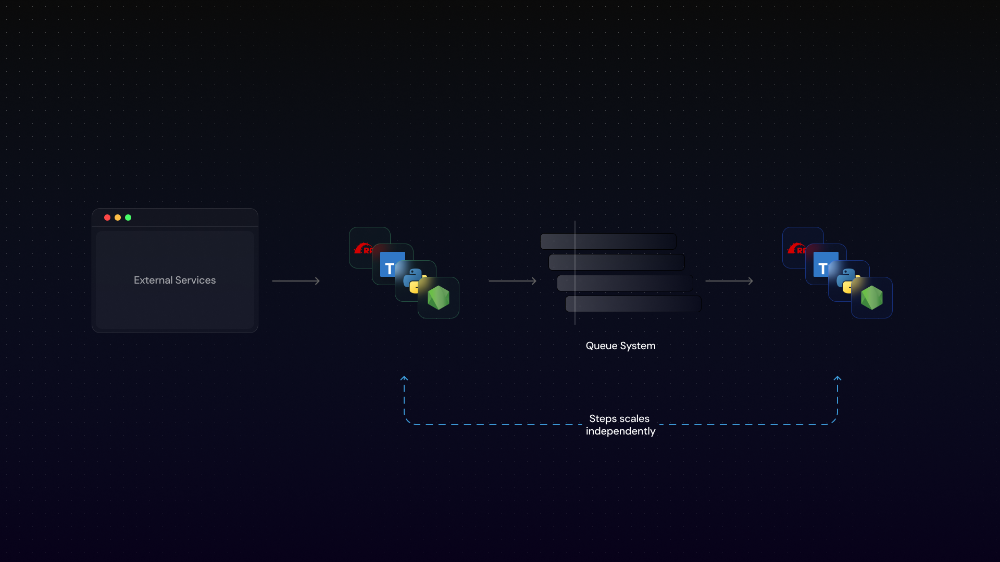
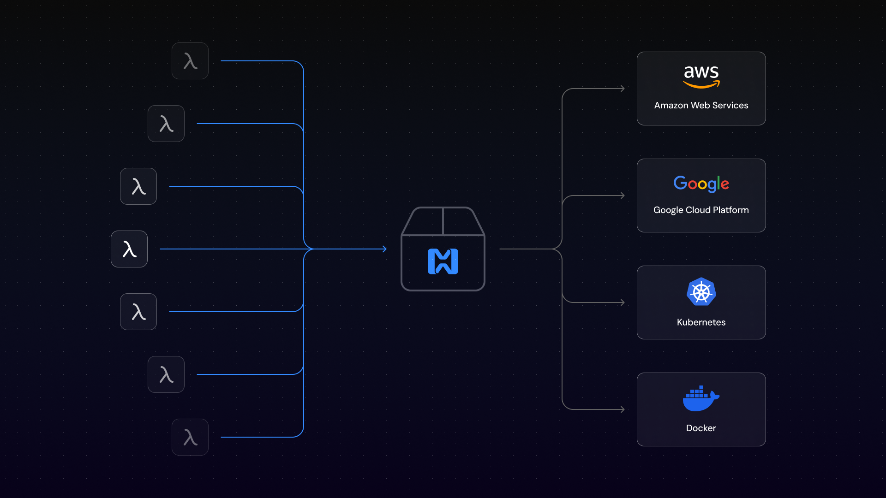
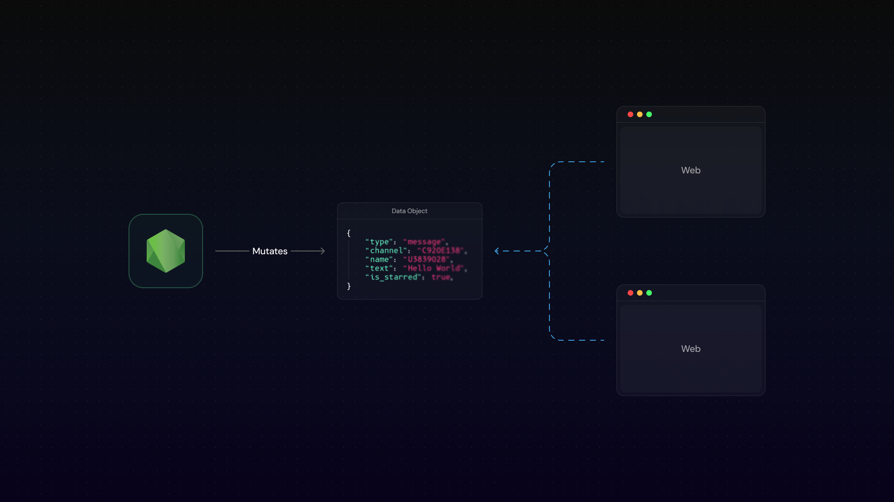

## Why use Mota

Today, backend engineers and software architects face several recurring problems. Mota was created to simplify these common backend engineering challenges in a flexible and elegant way to provide world class developer experience while ensuring robust, event-driven infrastructure.

- Unified vs. Fragmented backend
  - Working with multiple Languages
- Scalability
- Observability
- Fault tolerance
- Building and shipping
  - Rollbacks and deployment strategies
- Real-time data streaming

## How Mota simplifies all of this?

Similar to how React simplified frontend development where everything is a component, Mota simplifies backend development where everything is a Step. In Mota, every backend pattern becomes a group of compensable steps with unified state, events and observability. In this way, engineers only have to learn a few concepts about how a Mota Step works, and they get an enterprise-grade event-driven system out of the box.

- Steps represent a distinct entry point
- Steps can have different triggers
  - API Call _(Triggered by an HTTP request)_
  - Event _(Triggered by an event from another Step)_
  - CRON Job _(Triggered by a cron schedule)_
  - More will come soon (Check the [Roadmap](https://github.com/orgs/MotaDev/projects/2?pane=issue&itemId=121129696&issue=MotaDev%7Cmota%7C477))
- Steps are composable and can be chained together

## Unified vs. Fragmented backend

Modern software engineering is splintered. APIs live in one framework, background jobs in another, queues have their own tooling, and AI agents are springing up in yet more isolated runtimes. Mota exists to unify all of these concerns API endpoints, automations & workflows, background tasks, queues, and AI agents into a single, coherent system with shared observability and developer experience.

To read more about this, check out our [manifesto](/manifesto).

### Working with multiple Languages

The rapid advancement of AI has reshaped the software industry—many cutting-edge AI tools are available only in specific programming languages, this forces companies to decide if they either change their team's skillset to a different language or not leveraging these technologies at all.

Mota removes this limitation by allowing each Step to be written in any language, while still sharing a common state.

_Each rectangle in the diagram above represents a Step, some of them are in TypeScript and others in Python._

## Scalability

One of the biggest dilemmas in backend development is choosing between scalability and development velocity. In startup environments, speed often takes priority, resulting in systems that don't scale well and become problematic under increased load.

Mota addresses scalability by leveraging the core primitive of **Steps**: Each step can scale independently avoiding the bottlenecks common in monolithic architectures.

## Observability

Observability in traditional backends often demands significant engineering effort to implement logging, alerting, and tracing. Typically, these tools are only configured for cloud environments, local development is generally neglected—leading to low productivity and poor dev experience.

Mota offers a complete observability toolkit available in both cloud and local environments, including:

- Logs visualization
- Tracing tool to quickly visualize the flow of requests through the system
- State visualization
- Diagram representation of dependencies between steps and how they are connected

_The image below shows the Workbench interface available when you run `mota dev`. On the top panel you can see a workflow diagram with multiple steps connected.
On the bottom panel you can see the trace view of a single request and what happened in each step._

## Fault tolerance

With the rise of AI, many backend tasks have become less deterministic and more error-prone. These scenarios require robust error handling and retry mechanisms. In traditional systems, developers often need to set up and maintain queue infrastructures to ensure resilience, especially when dealing with unreliable responses from LLMs.

Mota provides fault tolerance out of the box, eliminating the need to manually spin up queue infrastructure.

- Using Event Steps, you get retry mechanisms out of the box
- Configuration of queue infrastructure is abstracted away

## Building and Shipping

Building and deploying backends is inherently complex—especially in polyglot environments. Shipping production systems requires tight collaboration between developers and operations, and automation often takes weeks to get right.

Beyond that, cloud provider lock-in, complicated deployment strategies (e.g., rollbacks, blue/green deployments), and a lack of deployment tooling increase the risk of failure.

Mota abstracts these concerns by providing:

- True cloud-provider agnosticism
- Atomic blue/green deployments and one-click rollbacks via Mota Cloud (canary support coming soon)
- First-class polyglot backend support (currently Node.js and Python, with more on the way)

_The image above shows several Steps being build to a single Mota deployable that are ultimately deployed to a cloud provider of your choice. 
Currently we're supporting AWS and Kubernetes, more Cloud providers coming soon. Check our [roadmap](https://github.com/orgs/MotaDev/projects/2/views/4?filterQuery=title%3A+BYOC) for more details._

### Rollbacks and deployment strategies

Deploying cloud-native, fault-tolerant applications often involves modifying queue systems and other infrastructure components. 
These changes can introduce incompatibilities and lead to runtime failures.

Mota Cloud solves this with **Atomic Deployments**, which:

- Each deployment spins up a new isolated service that shares the same data layer
- Ensures safe, rollback-capable deployments without risking service downtime
- Instant rollbacks with one click since each deployment is isolated

## Real-time data streaming

Handling real-time data is one of the most common—and complex—challenges in backend development. It's necessary when building event-driven applications, 
and it typically requires setting up and maintaining a significant amount of infrastructure.

Mota provides what we call _Streams_: Developers define the structure of the data—any changes to these objects are streamed to all subscribed clients in real-time.

_The image above shows a Stream definition, a Node.js Step mutating the data and a client subscribing to the stream receiving real-time updates._